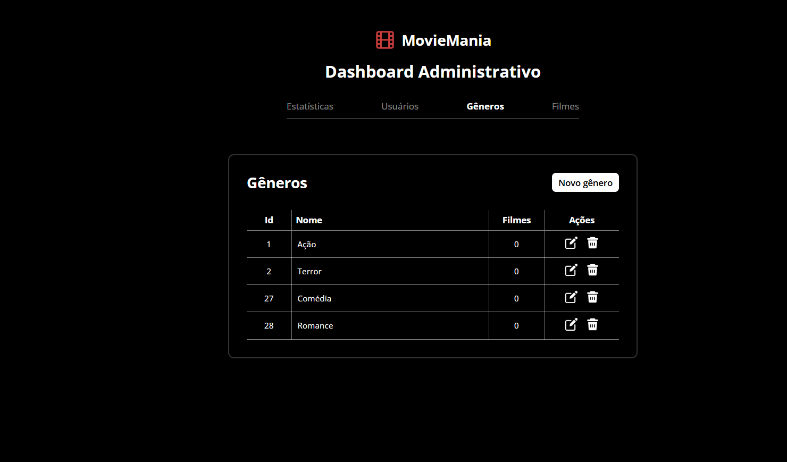
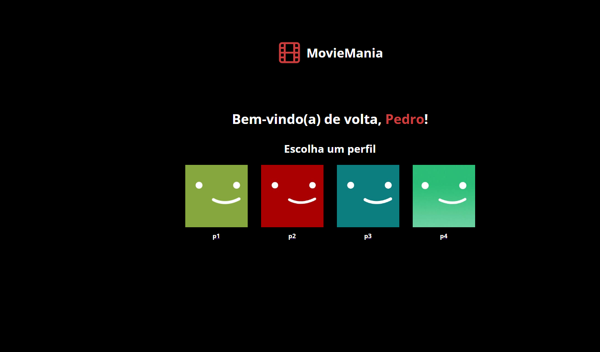
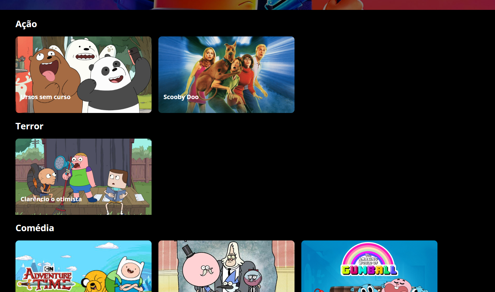

<h1 align="center"> MovieMania </h1>

Projeto desenvolvido durante a matéria Server-Side do curso de Engenharia de Software. 🚀🔥

  <a href="#-tecnologias">Tecnologias</a>&nbsp;&nbsp;&nbsp;|&nbsp;&nbsp;&nbsp;
  <a href="#-projeto">Projeto</a>&nbsp;&nbsp;&nbsp;|&nbsp;&nbsp;&nbsp;
  <a href="#-links">Links</a>

 

  

  

  

> Server-Side

Projeto do semestre da matéria de Server-Side, acompanhada pelo professor Paulo Manseira

## 🚀 Tecnologias

Esse projeto foi desenvolvido com as seguintes tecnologias:

- HTML 
- CSS
- JavaScript
- Git e Github
- NodeJs
- Express
- MySQL

  

## 💻 Projeto

MovieMania é uma aplicação web de streaming de filmes. A plataforma permite aos usuários navegar, buscar e avaliar filmes de um catálogo interativo. Implementa um sistema de controle de acesso com dois níveis de permissão: Usuário e Administrador, que possui funcionalidades exclusivas para o gerenciamento completo de conteúdo e usuários. Foi um grande desafio codar e aprender esse projeto!

## ⚙️ Como testar? 

Necessário fazer o download do banco enviado ao professor 

Passo 1: Banco de Dados
- Acesse seu cliente MySQL (Workbench, DBeaver, ou terminal).
- Crie o banco de dados com o comando: CREATE DATABASE moviemania;
- Selecione o banco recém-criado: USE moviemania;
- Importe o arquivo moviemania.sql fornecido. Importante: Este arquivo já contém a estrutura das tabelas e alguns dados de exemplo (filmes, gêneros e usuários) para facilitar os testes.

Passo 2: Aplicação
- Extraia a pasta do projeto em um diretório de sua preferência.
- Abra um terminal na raiz do projeto e instale as dependências:
    - npm install
- Após a instalação, inicie o servidor:
    - npm run start
- Acesse a aplicação no navegador em: http://localhost:3000 (ou a porta que você configurou).

Credenciais de Acesso para Teste
Para avaliar os diferentes níveis de permissão, utilize os seguintes usuários de teste (presentes no arquivo .sql):
- Administrador: admin // 123
- Usuário: teste@gmail.com // 123

Passo 3: Testes

A. Testes como Usuário Comum (Login: teste@gmail.com)
- Autenticação: Tente fazer login com as credenciais corretas e incorretas.
- Criação de conta: Siga os passos e depois entre na sua conta.
- Navegação: Acesse a página inicial e explore o catálogo de filmes (separados por gênero).
- Detalhes do Filme: Clique em um filme para ver sua página de detalhes, incluindo descrição e avaliações de outros usuários.
- Avaliaçáo de filme: Avalie o filme e veja os números e comentários.
- Validação de Permissão: Tente acessar URLs de administrador (ex: /admin/dashboard). O esperado é ser redirecionado.

B. Testes como Administrador (Login: admin)
- Acesso ao Painel: Após o login, acesse o painel de administração.
Gerenciamento de filmes / gêneros / usuários (CRUD):
- Criar: Cadastre um novo filme com título, descrição, gênero, etc.
- Ler: Verifique se o novo filme aparece na lista de filmes do painel e na página principal.
- Atualizar: Edite as informações de filmes, gêneros e usuários.
- Deletar: Remova registros.

## 🔗 Links

 
